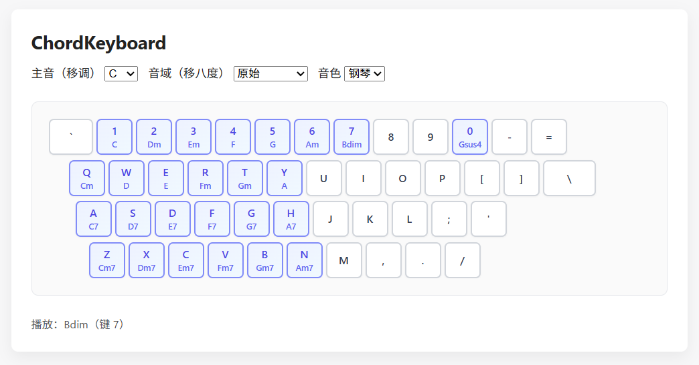

# ChordKeyboard

> English version is available at the end of the document.

ChordKeyboard是适用于首调唱名法的和弦演奏工具。浏览器中运行，允许通过电脑键盘演奏预设的和弦。
- 使用电脑键直接触发和弦。
- 支持两种音色：钢琴（piano）与弦乐（strings）。
- 可通过选择主音（移调）和音域（移八度）改变全部和弦的音高。

默认键位映射：
- `1` → C
- `2` → Dm
- `3` → Em
- `4` → F
- `5` → G
- `6` → Am
- `7` → Bdim

- `0` → Gsus4

- `Q` → Cm
- `W` → D
- `E` → E
- `D` → E7
- `R` → Fm
- `T` → Gm
- `Y` → A

其他未说明或未更新的键位请以页面显示为准。

运行方法：

1. 在浏览器中打开 [index.html](index.html)。
2. 选择主音（默认 C）、音域（默认原始）和音色（钢琴/弦乐）。
3. 按下上述键位即可演奏对应和弦。

音色说明：
- 默认音源：[soundfont-player](https://github.com/danigb/soundfont-player)。感谢该项目提供的高质量乐器采样。
- 若浏览器或网络无法加载 SoundFont，则回退到基于 `OscillatorNode` 的合成音色。

---

## English Version

ChordKeyboard is a chord-playing tool designed for Movable-do system. It runs in a web browser and allows playing preset chords using a computer keyboard.  
- Use computer keys to trigger chords directly.  
- Supports two timbres: piano and strings.  
- The pitch of all chords can be changed by selecting the tonic (transposition) and range (octave shift).  

Default key mapping:  
- `1` → C  
- `2` → Dm  
- `3` → Em  
- `4` → F  
- `5` → G  
- `6` → Am  
- `7` → Bdim  

- `0` → Gsus4  

- `Q` → Cm  
- `W` → D  
- `E` → E  
- `D` → E7  
- `R` → Fm  
- `T` → Gm  
- `Y` → A  

For other unspecified or updated key mappings, please refer to the on-screen display.  

**How to run:**  

1. Open index.html in a browser.  
2. Select the tonic (default: C), range (default: original), and timbre (piano/strings).  
3. Press the keys mentioned above to play the corresponding chords.  

**About Timbres:**  
- Default sound source: [soundfont-player](https://github.com/danigb/soundfont-player). Thanks to the project for providing high-quality instrument samples.  
- If the browser or network cannot load SoundFont, it falls back to a synthesized sound based on `OscillatorNode`.